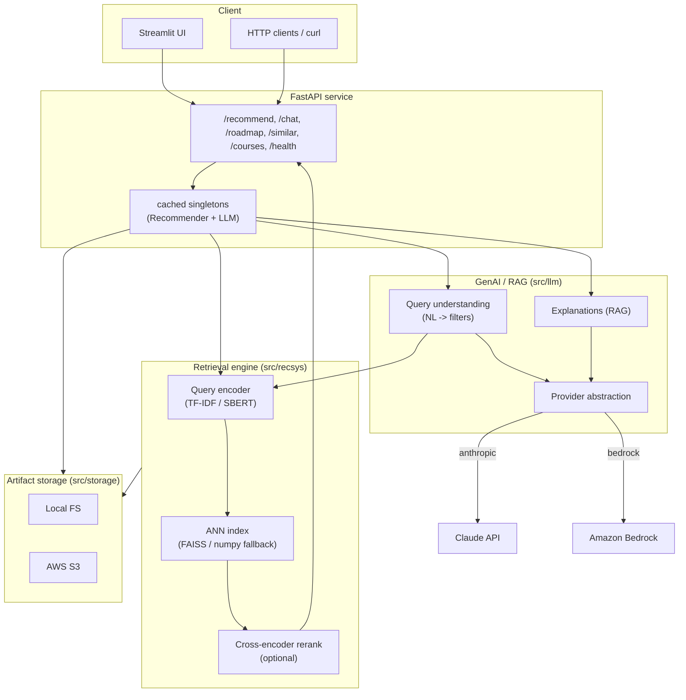
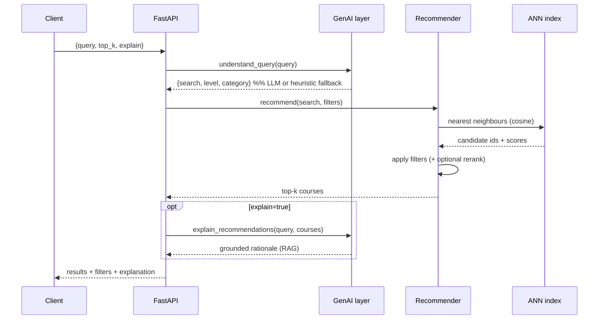
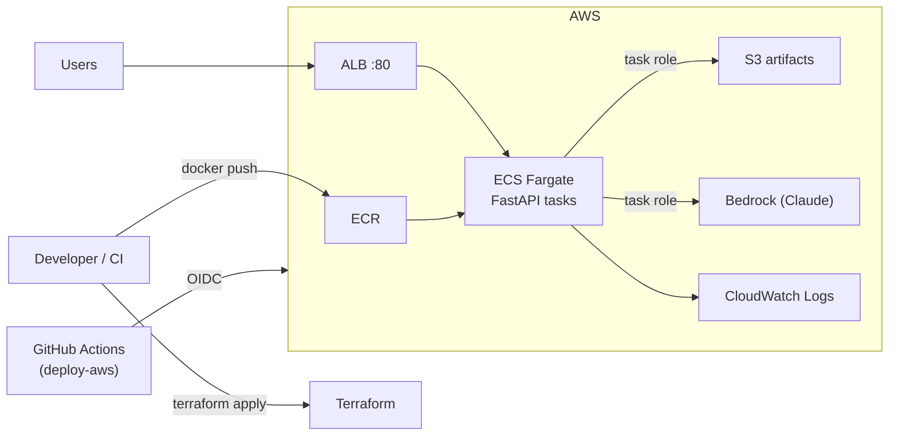

# Architecture

A content-based course recommender re-shaped as a production, cloud-deployable
service. Three layers — **retrieval engine**, **GenAI/RAG**, **serving** — sit
behind a storage abstraction so the same code runs on a laptop and on AWS.

## System overview

## Request flow: `POST /recommend`

## Two-stage retrieval

1. **Recall** — the query is embedded and searched against the course index.
   - `sbert` backend: dense Sentence-BERT vectors, FAISS inner-product on
     normalized vectors (= cosine). Falls back to a vectorized numpy search
     when FAISS is unavailable, so behaviour is identical, only slower.
   - `tfidf` backend: sparse TF-IDF + exact cosine. No model downloads.
2. **Precision** — an optional cross-encoder rescoring of the shortlist
   (`ENABLE_RERANK=true`), blending first-stage and cross-encoder scores.

Filters (level/category) are applied as a post-retrieval mask so semantic
ranking is preserved within the filtered set.

## GenAI / RAG layer

- **Query understanding** rewrites a messy request into a clean semantic query
  plus structured filters. An LLM does this when configured; otherwise a
  deterministic heuristic keeps the endpoint fully functional.
- **Explanations** are Retrieval-Augmented: the *retrieved* courses are the
  grounding context, so the model explains real results rather than
  hallucinating a catalog.
- **Provider abstraction** makes `anthropic` (Claude API) and `bedrock`
  (Claude on AWS Bedrock) interchangeable via one env var. On ECS, Bedrock
  needs no API key — the task IAM role authorizes it.

## Storage abstraction

`ArtifactStore` (local / S3) is the seam that decouples training from serving.
`python -m src.pipeline --mode build` writes artifacts through it; the service
reads through it. Switching from a laptop to AWS is a change of
`ARTIFACT_STORE=s3` + `ARTIFACT_S3_BUCKET`, no code change.

Artifacts: `meta.json`, `courses.parquet`, and either
(`embeddings.npy` + `vector.index`) or (`tfidf_vectorizer.pkl` + `X_tfidf.npz`),
plus `kmeans.pkl` for the cluster labels.

## AWS deployment

See [`infra/aws/README.md`](../infra/aws/README.md) for the deploy runbook.
